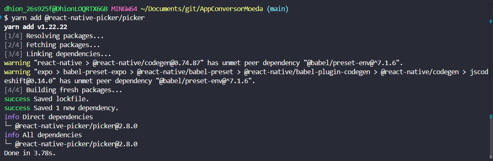
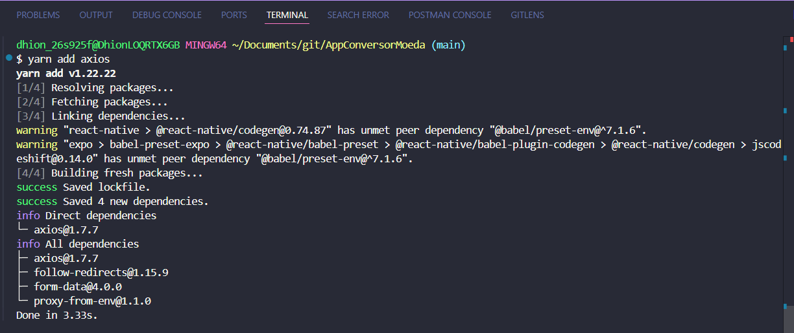
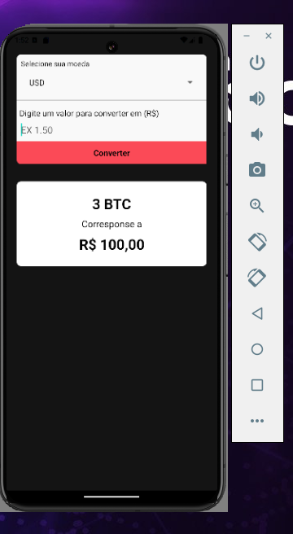

# Preview commits
* Adicionano picker ao projeto:
` yarn add @react-native-picker/picker`

* Adicionando o axios ao projeto
`yarn add axios`

* consumindo api e colocando loading indicativo do carregamento dos dados:

* Implementando front end de rascunho:

* BackEnd conversão de moedas aplicado:
